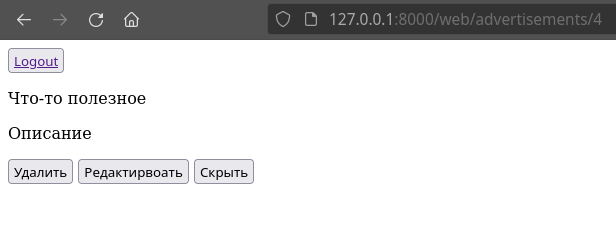

## ER-diagram


## LAB-8

Страница пользователя, фото профиля хранится в Yandex Object Storage


## LAB-10 (Авторизация)

Страница авторизации


Страница от пользователя-клиента


Страница от пользователя-автора



## LAB-11 (Elasticsearch, Redis и расстояние Левенштейна)

Elasticsearh - поиск по объявлениям, используется библиотека ```django_elasticsearch_dsl```


Redis - кеширование запросов к объявлениям

### Расстояние Левенштейна

```
def levenstein_distance(s1: str, s2: str,
        insert_cost: int = 1,
        delete_cost: int = 1,
        replace_cost: int = 1):
    """
    >>> levenstein_distance('abc', '')
    3
    >>> levenstein_distance('', 'abc')
    3
    >>> levenstein_distance('abc', 'def')
    3
    >>> levenstein_distance('abc', 'abc')
    0
    >>> levenstein_distance('abc', 'abcd')
    1
    >>> levenstein_distance('abcd', 'abc')
    1
    >>> levenstein_distance('', '')
    0
    """
    n = len(s1)
    m = len(s2)

    dp = [[0 for _ in range(len(s2) + 1)] for _ in range(len(s1) + 1)]

    for i in range(n + 1):
        dp[i][0] = i * delete_cost

    for j in range(m + 1):
        dp[0][j] = j * insert_cost

    for i in range(1, n + 1):
        for j in range(1, m + 1):
            if s1[i - 1] == s2[j - 1]:
                dp[i][j] = dp[i - 1][j - 1]
                continue
            dp[i][j] = min(
                    dp[i - 1][j - 1] + replace_cost,
                    dp[i - 1][j] + delete_cost,
                    dp[i][j - 1] + insert_cost)

    return dp[n][m]


if __name__ == "__main__":
    import doctest
    doctest.testmod()
    print('Testing completed')
```

## Coverage

```
Name                                Stmts   Miss  Cover
-------------------------------------------------------
api_v0/__init__.py                      0      0   100%
api_v0/admin.py                         5      0   100%
api_v0/forms.py                        11      0   100%
api_v0/migrations/0001_initial.py      10      0   100%
api_v0/migrations/__init__.py           0      0   100%
api_v0/models.py                       20      0   100%
api_v0/serializers.py                  16      0   100%
api_v0/tests/__init__.py                0      0   100%
api_v0/tests/test_models.py            13      0   100%
api_v0/tests/test_views.py             66      0   100%
api_v0/urls.py                         11      0   100%
api_v0/views.py                        29      1    97%
craigslist/__init__.py                  0      0   100%
craigslist/settings.py                 29      0   100%
craigslist/urls.py                      4      0   100%
manage.py                              12      2    83%
web/__init__.py                         0      0   100%
web/admin.py                            1      0   100%
web/migrations/__init__.py              0      0   100%
web/models.py                           1      0   100%
web/tests.py                            1      0   100%
web/urls.py                             7      0   100%
web/views.py                           21      6    71%
-------------------------------------------------------
TOTAL                                 257      9    96%
```

## Useful links

[Using docker with nginx, postgres and django](https://fixmypc.ru/post/sozdanie-i-zapusk-konteinera-docker-s-django-postgressql-gunicorn-i-nginx/)

### nginx
```
>>> ab -c 100 -n 10000 http://127.0.0.1:8070/
This is ApacheBench, Version 2.3 <$Revision: 1879490 $>
Copyright 1996 Adam Twiss, Zeus Technology Ltd, http://www.zeustech.net/
Licensed to The Apache Software Foundation, http://www.apache.org/

Benchmarking 127.0.0.1 (be patient)
Completed 1000 requests
Completed 2000 requests
Completed 3000 requests
Completed 4000 requests
Completed 5000 requests
Completed 6000 requests
Completed 7000 requests
Completed 8000 requests
Completed 9000 requests
Completed 10000 requests
Finished 10000 requests


Server Software:        nginx/1.20.2
Server Hostname:        127.0.0.1
Server Port:            8070

Document Path:          /
Document Length:        44391 bytes

Concurrency Level:      100
Time taken for tests:   0.503 seconds
Complete requests:      10000
Failed requests:        0
Total transferred:      446270000 bytes
HTML transferred:       443910000 bytes
Requests per second:    19894.92 [#/sec] (mean)
Time per request:       5.026 [ms] (mean)
Time per request:       0.050 [ms] (mean, across all concurrent requests)
Transfer rate:          867041.38 [Kbytes/sec] received

Connection Times (ms)
              min  mean[+/-sd] median   max
Connect:        0    0   0.2      0       3
Processing:     1    5   0.4      5       8
Waiting:        0    5   0.5      5       7
Total:          4    5   0.4      5       8

Percentage of the requests served within a certain time (ms)
  50%      5
  66%      5
  75%      5
  80%      5
  90%      5
  95%      6
  98%      6
  99%      6
 100%      8 (longest request)
```

### gunicorn
```
>>> ab -c 100 -n 10000 http://127.0.0.1:8000/
This is ApacheBench, Version 2.3 <$Revision: 1879490 $>
Copyright 1996 Adam Twiss, Zeus Technology Ltd, http://www.zeustech.net/
Licensed to The Apache Software Foundation, http://www.apache.org/

Benchmarking 127.0.0.1 (be patient)
Completed 1000 requests
Completed 2000 requests
Completed 3000 requests
Completed 4000 requests
Completed 5000 requests
Completed 6000 requests
Completed 7000 requests
Completed 8000 requests
Completed 9000 requests
Completed 10000 requests
Finished 10000 requests


Server Software:        gunicorn
Server Hostname:        127.0.0.1
Server Port:            8000

Document Path:          /
Document Length:        44391 bytes

Concurrency Level:      100
Time taken for tests:   1.362 seconds
Complete requests:      10000
Failed requests:        0
Total transferred:      445600000 bytes
HTML transferred:       443910000 bytes
Requests per second:    7341.06 [#/sec] (mean)
Time per request:       13.622 [ms] (mean)
Time per request:       0.136 [ms] (mean, across all concurrent requests)
Transfer rate:          319450.60 [Kbytes/sec] received

Connection Times (ms)
              min  mean[+/-sd] median   max
Connect:        0    0   0.3      0       5
Processing:     2   13   2.2     13      29
Waiting:        1   13   2.1     13      29
Total:          5   13   2.1     13      29

Percentage of the requests served within a certain time (ms)
  50%     13
  66%     13
  75%     14
  80%     14
  90%     17
  95%     18
  98%     20
  99%     22
 100%     29 (longest request)
```
