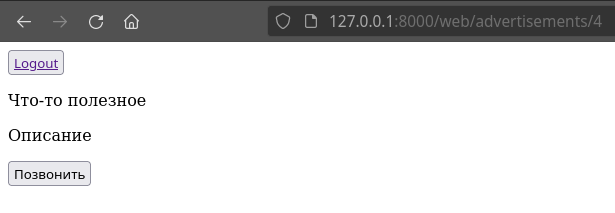

## ER-diagram


## LAB-10 (Авторизация)

Страница авторизации


Страница от пользователя-клиента



Страница от пользователя-автора


## LAB-11 (Elasticsearch, Redis и расстояние Левенштейна)

Elasticsearh - поиск по объявлениям, используется библиотека ```django_elasticsearch_dsl```


Redis - кеширование запросов к объявлениям

### Расстояние Левенштейна

```
def levenstein_distance(s1: str, s2: str,
        insert_cost: int = 1,
        delete_cost: int = 1,
        replace_cost: int = 1):
    """
    >>> levenstein_distance('abc', '')
    3
    >>> levenstein_distance('', 'abc')
    3
    >>> levenstein_distance('abc', 'def')
    3
    >>> levenstein_distance('abc', 'abc')
    0
    >>> levenstein_distance('abc', 'abcd')
    1
    >>> levenstein_distance('abcd', 'abc')
    1
    >>> levenstein_distance('', '')
    0
    """
    n = len(s1)
    m = len(s2)

    dp = [[0 for _ in range(len(s2) + 1)] for _ in range(len(s1) + 1)]

    for i in range(n + 1):
        dp[i][0] = i * delete_cost

    for j in range(m + 1):
        dp[0][j] = j * insert_cost

    for i in range(1, n + 1):
        for j in range(1, m + 1):
            if s1[i - 1] == s2[j - 1]:
                dp[i][j] = dp[i - 1][j - 1]
                continue
            dp[i][j] = min(
                    dp[i - 1][j - 1] + replace_cost,
                    dp[i - 1][j] + delete_cost,
                    dp[i][j - 1] + insert_cost)

    return dp[n][m]


if __name__ == "__main__":
    import doctest
    doctest.testmod()
    print('Testing completed')
```

## Coverage

```
Name                                Stmts   Miss  Cover
-------------------------------------------------------
api_v0/__init__.py                      0      0   100%
api_v0/admin.py                         5      0   100%
api_v0/forms.py                        11      0   100%
api_v0/migrations/0001_initial.py      10      0   100%
api_v0/migrations/__init__.py           0      0   100%
api_v0/models.py                       20      0   100%
api_v0/serializers.py                  16      0   100%
api_v0/tests/__init__.py                0      0   100%
api_v0/tests/test_models.py            13      0   100%
api_v0/tests/test_views.py             66      0   100%
api_v0/urls.py                         11      0   100%
api_v0/views.py                        29      1    97%
craigslist/__init__.py                  0      0   100%
craigslist/settings.py                 29      0   100%
craigslist/urls.py                      4      0   100%
manage.py                              12      2    83%
web/__init__.py                         0      0   100%
web/admin.py                            1      0   100%
web/migrations/__init__.py              0      0   100%
web/models.py                           1      0   100%
web/tests.py                            1      0   100%
web/urls.py                             7      0   100%
web/views.py                           21      6    71%
-------------------------------------------------------
TOTAL                                 257      9    96%
```

## Useful links

[Using docker with nginx, postgres and django](https://fixmypc.ru/post/sozdanie-i-zapusk-konteinera-docker-s-django-postgressql-gunicorn-i-nginx/)
